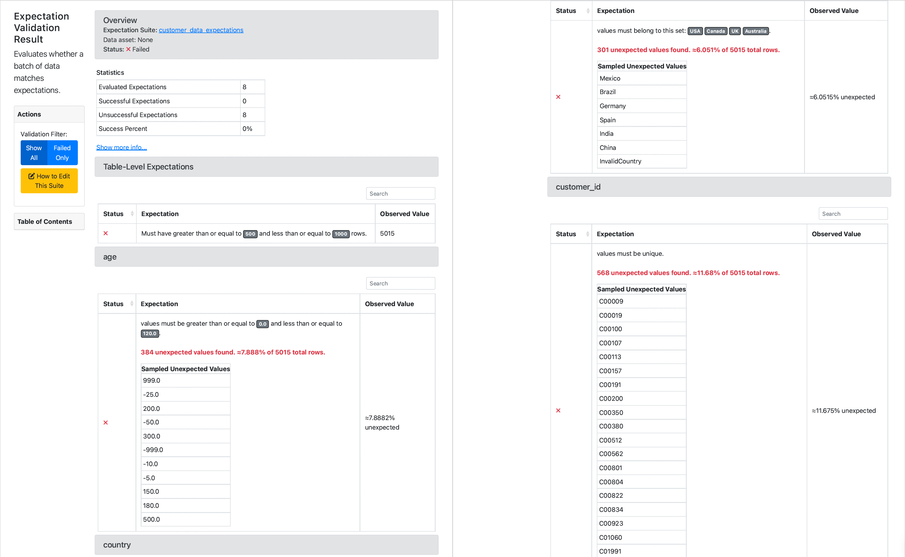
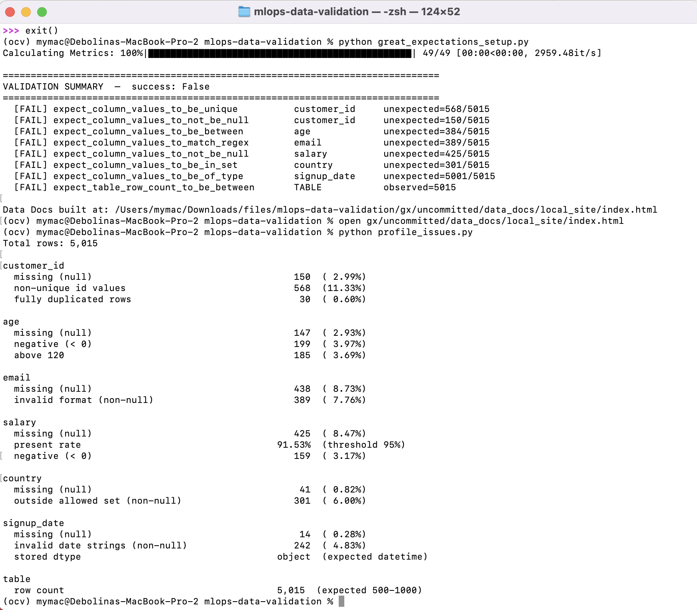
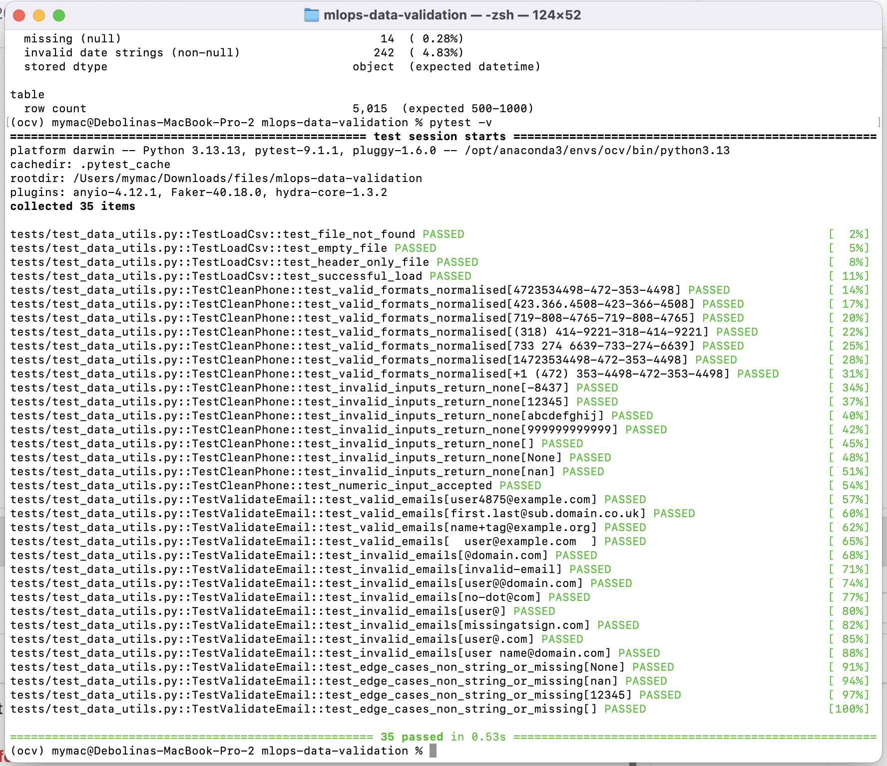

# Assignment 2 — Data Validation & Testing

MLOps; Tools: Great Expectations 1.18, pytest 9
Dataset: `data/customer_data.csv` — 5,015 customer records

## 1. Great Expectations validation results

The `customer_data_expectations` suite was run against the full dataset. All
eight expectations failed, which is the expected outcome for a deliberately
messy dataset. The screenshot below is the Great Expectations Data Docs
validation result page, produced by `python great_expectations_setup.py` and
opened from `gx/uncommitted/data_docs/local_site/index.html`.

The Overview reports 8 evaluated expectations, 0 successful, 8 unsuccessful
(0% success), with sampled unexpected values shown for each failing column.

---

## 2. Data quality issues found (counts per issue)

Counts are reproducible via `python profile_issues.py`. Percentages are of the
5,015 total rows.

Additional cleaning concern surfaced by the `clean_phone` utility (not an
expectation but documented for completeness): the `phone` column mixes
`4723534498`, `423.366.4508`, `(318) 414-9221`, `733 274 6639` and junk values
like `-8437`, and 319 phone numbers are missing.

---

## 3. pytest results

Thirty-five unit tests cover the three utility functions; all pass.

Coverage summary:

- `load_csv` — file-not-found, empty file, header-only file, and a
  successful load with shape/column assertions.
- `clean_phone` — seven valid formats normalised to `XXX-XXX-XXXX`
  (including an 11-digit country-code case and a symbol-laden international
  string), plus seven invalid inputs (too few/many digits, non-numeric, empty,
  `None`, `NaN`) returning `None`, and an integer-input case.
- `validate_email` — valid addresses (including subdomains, `+tag`, and
  surrounding whitespace), eight malformed addresses from the actual dataset,
  and non-string / missing edge cases (`None`, `NaN`, `int`, empty string).

---

## 4. Reflection — which issue most impacts model performance

If the downstream model predicts or uses salary (e.g. a credit or
segmentation model), the negative and missing salary values are the most
damaging issue. The reasoning:

1. Direct corruption of the target/feature distribution. 159 negative
   salaries are not noise around a true value, they are sign-flipped or
   sentinel garbage that pulls the mean down and inflates variance. A model
   trained on them learns a distribution that does not exist in reality, and any
   scaler fit on this column (standardization, min-max) inherits the
   contamination, distorting every other feature that shares the pipeline.

2. Missingness at 8.5% forces an imputation decision that leaks bias. Naïve
   mean/median imputation on a column already skewed by negatives propagates the
   corruption; dropping the rows discards ~425 records and can bias the sample
   if missingness is not random.

3. It is silent. Unlike a malformed email or an out-of-range age — which are
   obviously wrong — a negative salary still looks numeric and will pass through
   un-validated pipelines undetected, degrading the model in production without
   raising an error.

The out-of-range `age` values (384 rows of negatives and impossible ages)
are a close second for the same reason: they are numerically valid but
semantically nonsensical, so they quietly skew any model that consumes age.

By contrast, invalid emails and non-standard phone formats matter most
for record linkage and data hygiene but have little direct effect on a typical
predictive model, since these fields are rarely used as model features.
Duplicate records are also serious but in a different way: they bias the
model toward over-represented customers and, more importantly, cause train/test
leakage if the same customer lands in both splits — inflating validation
metrics and giving a false sense of model quality.

Conclusion: numeric out-of-range and missing values in model features
(salary, age) most directly harm model performance, because they corrupt the
learned distribution while remaining invisible to type-only checks — which is
exactly why a value-level Great Expectations suite belongs in the retraining
pipeline.
